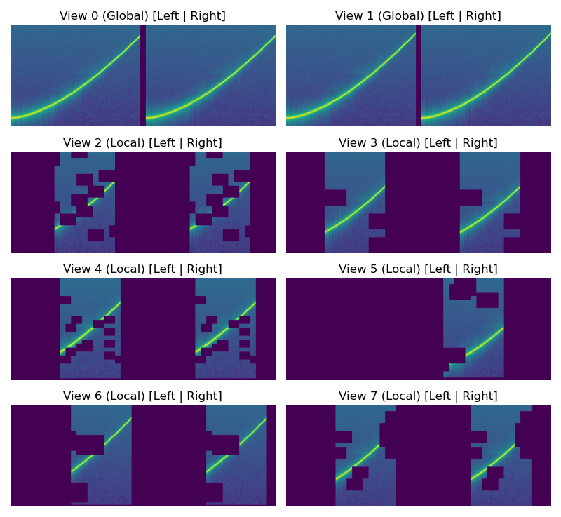

# MyGO: Audio Foundation Model via LeJEPA

**Repository:** [https://github.com/yubowang1-ctrl/MyGo](https://github.com/yubowang1-ctrl/MyGo)

**Contributors:** Lixing Wang, Yubo Wang, Yixuan Liu

Final Project for CS1470: Deep Learning at Brown University

## Abstract
We plan to develop a robust **Audio Foundation Model** using Self-Supervised Learning (SSL). By adapting the **Vision Transformer (ViT)** architecture for audio spectrograms and employing **LeJEPA** (Latent Joint Embedding Predictive Architecture), this project seeks to learn high-quality semantic audio representations.

## 1. Introduction
Foundation models have revolutionized computer vision and natural language processing. In the audio domain, AST has demonstrated that treating audio as images (spectrograms) is a viable strategy. However, features learned from standard supervised training can be limited, which compromises the power to adapt to different downstream tasks.

This project explores SSL for audio using the **LeJEPA** objective. LeJEPA trains the model to predict the latent representation of one view of the input from another. This encourages the model to capture high-level semantic information invariant to augmentation. It enforces isotropic Gaussian distribution among output embeddings, which not only prevent collapse by construction but is also proved to be optimal for downstream tasks. This theoretically grounded approach is ideal for building a robust foundation model.

## 2. Prior Works
- **Audio Spectrogram Transformer (AST):** 
AST converts audio to spectrograms (images) and makes use of ViT for audio classification. This is a supervised learning approach enforcing loss on the output of a classification head.

- **LeJEPA:** 
A self-supervised learning method that trains the model to predict global view embeddings from local views, thus extracting semantic meanings consistently. It enforces isotropic Gaussian distribution among output embeddings, which prevent collapse by construction.

- **Self-supervised Audio Spectrogram Transformer (SSAST)**
Patches to AST are randomly masked and for each masked patch, the model is trained to both reconstruct the patch and identify among all masked patches which patch this is, called "Joint Discriminative and Generative Masked Spectrogram Patch Modeling" in the paper. A separate linear head is applied to the mean of all output embeddings. The model outperforms AST on downstream classification tasks.

## 3. Methodology

### 3.1. Data Representation
We process raw audio into Log-Mel spectrograms, duo channel 2D images where the vertical axis represents frequency and the horizontal axis represents time. Each sample conforms to the following specifications:
*   Sampling Rate: 48 kHz
*   Spectrogram: 4096-point windowed FFT, 2048-point step size, 256 Mel bins
*   Frequency Range: 60 Hz to 12 kHz
*   Duration: 10s
*   Channels: 2 (Stereo)
*   Views: 2 global and 6 local views per sample, each subject to augmentations
*   Patching: The spectrogram is divided into $16 \times 16$ patches with an overlap of 6. (These parameters are recommended by the AST paper.) Each patch is flattened and projected to an embedding vector.

### 3.2. Network Architecture
We use a Transformer-based architecture adapted from ViT, similar to AST. In AST, a 768-dimensional positional encoding is used for each patch in ViT style. However, to address the fundamental difference between the time and frequency dimensions in audio, we propose a decoupled positional encoding strategy:
*   Frequency Positional Encoding: An absolute embedding added to patch embeddings. This should be absolute, as major shifts in pitches change its semantic meaning. Two patches sharing same frequency range receive same frequency positional encoding, regardless of time.
*   Relative Time Positional Encoding: A relative attention bias added to the self-attention matrix. This encoding must be relative, since translation in time does not change the semantic meanings of an audio. Each attention head maintains a trainable attention bias table for the time dimension. Attention scores between any two embeddings with the same time frame difference receive the same attention bias. An additional bias table is created for the `cls` token to allow bias attention to all tokens.

### 3.3. The LeJEPA Objective
The training objective minimizes the distance between the average output embeddings of global views and the output embeddings of all views, while enforcing the embeddings to conform to an isotropic Gaussian distribution. Thus the loss function consists of two components:
*   Invariance Loss: 

$$
L_{\text{inv}} = \mathbb{E}_{x \sim \mathcal{D}} \mathbb{E}_{v \sim \mathcal{V}(x)} \left[ \left\lVert z_g^{\text{avg}}(x) - z_v(x) \right\rVert_2^2 \right]
$$

where $z_g^{\text{avg}}(x) = \frac{1}{G} \sum_{i=1}^{G} z_{g_i}(x)$ is the average embedding of all global views of input $x$, and $z_v(x)$ is the embedding of view $v$ of input $x$.
*   SIGReg: Utilizes the Epps-Pulley test statistic on many random directions of a batch of embeddings to ensure they conform to an isotropic Gaussian distribution.

### 3.4 Hyper-parameters
For the hyper-parameters and cosine schedules, we plan the follow the settings as outlined in LeJEPA paper. We first train a small transformer on the Balanced Set (a subset) of AudioSet before proceeding to larger models and data sizes.

### 3.4 Evaluation
We train a linear probe to test for performance on the downstream task classification on AudioSet. We use mAP for evaluation, because AudioSet is a multi-label classification task and this makes direct comparison with AST and SSAST possible.

We also visualize the attention map for the last layer of the model to see what structure it has extracted. We convert the visualization back to audio for hearing evaluation.

If we have extra time, we would also like to include additional datasets such as ESC-50 & Speech Commands V2 (35 classes). We also might build a small demo app that extract regions of audio with similar semantic meaning given a selection of the audio.

## 4. Implementation Details

### 4.1. Data Pipeline
We utilize the **AudioSet** dataset. Currently, we leverage the Balanced Set, which consists of roughly 20,000 audio clips. The full dataset consists of over 2M audio clips. Preprocessing all clips beforehand is not feasible. To ensure the scalability and avoid IO bottlenecks, we implemented the following TensorFlow data pipeline:
*   On-the-fly Processing: The dataset only keeps a list of paths to audio clips. Only when a batch is requested, the dataset fetches, processes, and augments audio files.
*   Chunking: Audio files longer than 10 seconds are split into multiple segments, while shorter files are looped or padded.
*   Augmentation: We apply multiple augmentations to generate different views. Techniques include random cropping on time axis, random masking, mild time stretch, mild pitch shift, random spectral convolution, and random channel drop. The processings are heavior for local views and lighter for global views. Note that all augmentations are stochastic, except that there is no time crop on global views.
*   Parallelism and Prefetching: We leverage TensorFlow's `tf.data` API to maximize the performance of data loading and processing. Prefetching is employed to reduce waiting time of GPU.

Note: Random masking and random time crop are applied on patch level. For time crop, the uncropped region is continuous in time. For random masking, our implementation follows a similar strategy as in SSAST where a cluster coefficient controls the clustering of masks, and the number of masks is controlled. However, we vectorized this process with tensorflow APIs and were only able to approximately control the number of masks. So it may vary to some degree from views to views.

Note: The masked embeddings are replaced by a learnable mask embedding.
<p align="center">
    
    <br>
    <em>Figure 1: Patch-level time crop and masking with other augmentations.</em>
</p>

### 4.2. Distributed Training
The training loop is implemented in TensorFlow 2.x and supports distributed training via `tf.distribute.MirroredStrategy`. A batch is divided among multiple GPUs. Each GPU computes the forward pass on its own, and the gradients are averaged across all GPUs. This allows for large batch sizes and faster training.

## 5. Usage

### Prerequisites
*   Python 3.9+
*   TensorFlow 2.x
*   Librosa, FFmpeg, yt-dlp (for downloading AudioSet)

### Data Preparation
To download and preprocess the AudioSet segments:
```bash
python3 scripts/download_audio_segments.py \
    --csvfile "data/audioset/unbalanced_train_segments.csv" \
    --workers 42 \
    --outdir "data/audio_files/"
```
Note: Do not download the files to ExFAT disks as their directory entry table only supports linear lookup, which is extremely slow for large datasets.

## 6. Division of Labor

| Team Member | Contributions |
| :--- | :--- |
| **Yubo Wang** | Data engineering (preprocessing, windowed STFT), Multi-view generation pipeline |
| **Lixing Wang** | Model architecture design (ViT, Positional Embeddings), LeJEPA loss implementation, Multi-view generation pipeline, Distributed training loop, Linear probe classification |
| **Yixuan Liu** | Evaluation metrics, Visualization (PCA, Attention Maps), Performance analysis |
